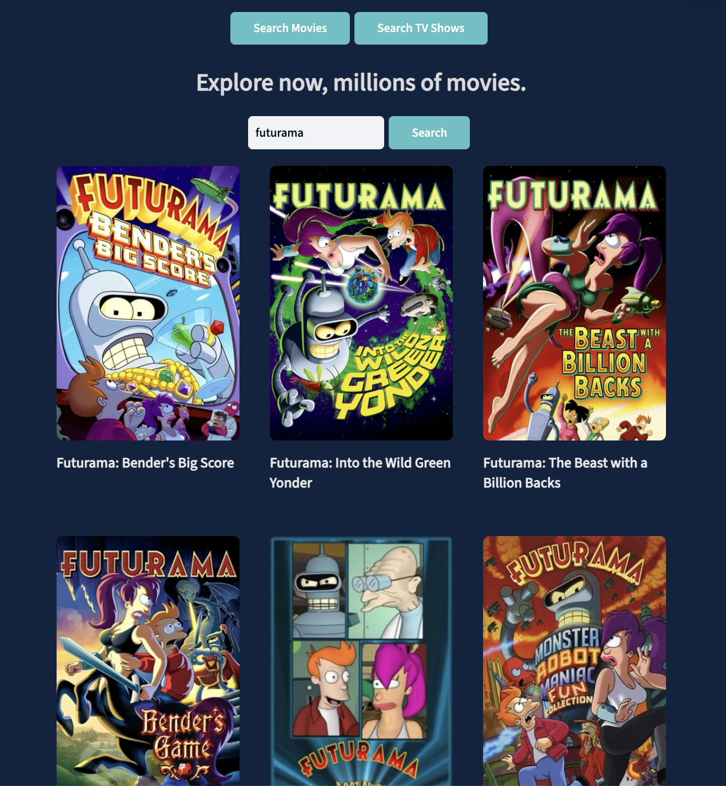

# Movies-App
Application in React, that allows you to search for movies and TV shows.


## About 📖
Application in React, that allows you to search for movies and TV shows. In the movies section, users can click on a movie and see more details, such as: synopsis, release date, and genre. And in the TV shows section it allows you to search and filter by date.

*(TMDb) API is used in this app. More information  [here](https://developer.themoviedb.org/)*.


## Built With 🛠👩🏻‍💻

- [React] (https://react.dev/) - Makes it easy to build interactive and reactive user interfaces.
- [Vite] (https://vitejs.dev/) - Allows fast and efficient compilation.
- [Fetch] (https://developer.mozilla.org/es/docs/Web/API/Fetch_API/Using_Fetch) - The Fetch API provides a JavaScript interface for accessing and manipulating data.

### Recommended Setup
- [Visual studio code](https://code.visualstudio.com/)
- [Git](https://git-scm.com/)
- [Yarn](https://yarnpkg.com/getting-started/install)

## How to run de project 🏃🏽

### Install Dependencies
Ensure that you have Node.js and yarn (or npm) installed on your machine. Then, navigate to the project directory and run the following command to install dependencies:

```sh
yarn install
```

### Compile and Hot-Reload for Development

```sh
yarn dev
```

### Type-Check, Compile and Minify for Production

```sh
yarn build
```

### Lint with [ESLint](https://eslint.org/)

```sh
yarn lint
```


## Discuss 💬

Have any questions, doubts or want to present your opinions, views? You're always welcome. You can [start discussions](https://github.com/Kar3njul1eth/movies-App/issues).

